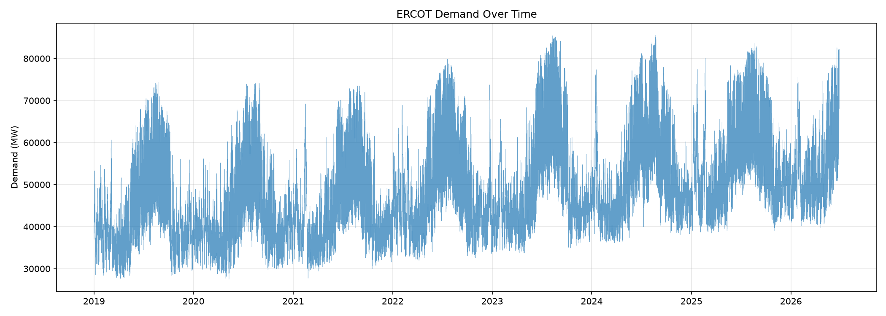
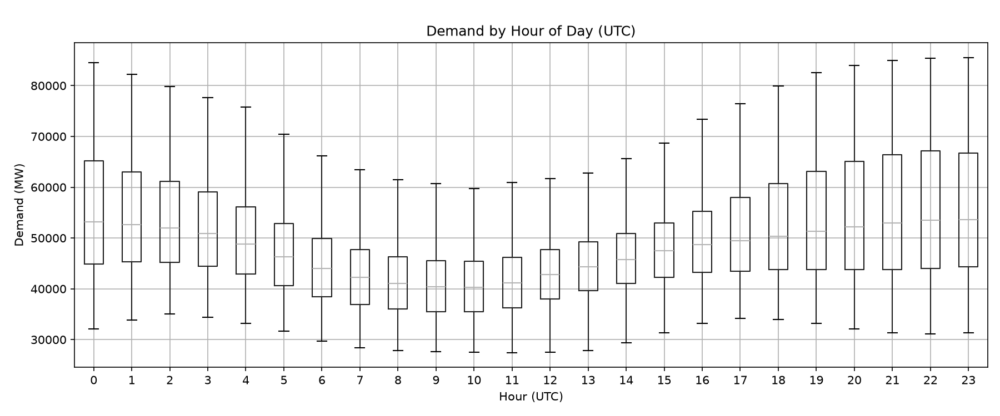
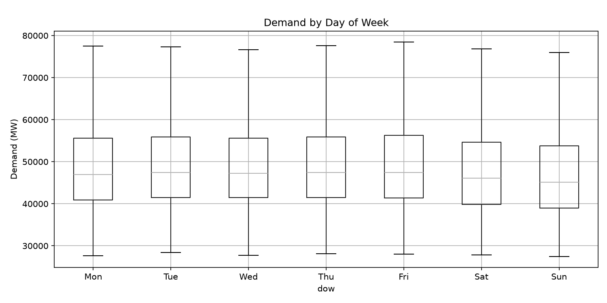
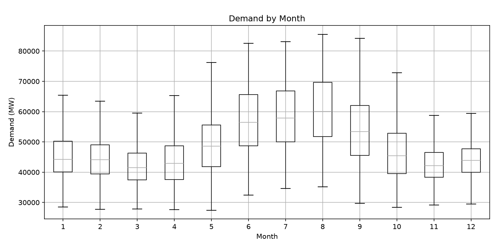
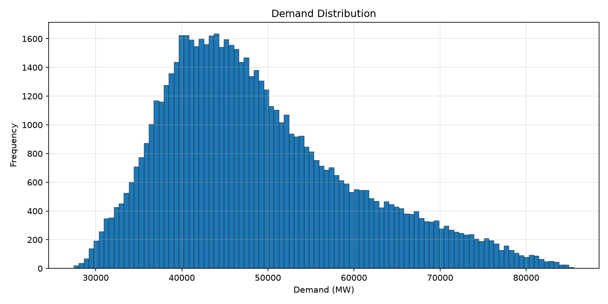
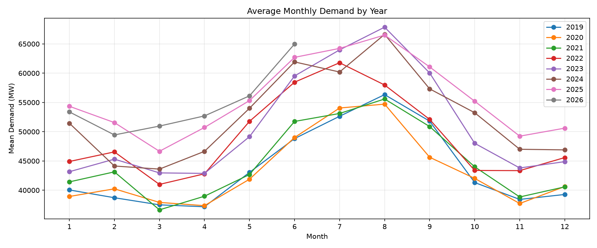

This is a project in progress to help understand how to create automatic data ingestion pipelines. It is hosted on my personal linux server. 

This pipeline ingests daily Texas grid demand from the EIA API and  populates a csv(will populate postgress soon). It also versions the data using DVC and then pushes the artifacts to an AWS S3 Bucket. 
On arrival, the S3 Bucket triggers an AWS Lambda function to observe the daily ingestion metadata and send success/failures health reports to my email via AWS SNS. Everything is triggered automatically every night via cron and shell scripts. 

Phase 2(In Progress) 

Train XGboost model to predict future demand. 90 percent of this will also be automated/

Phase 3(Planned)

FAST API backend and Streamlit for dashboard to display future grid demands. 

### Full Demand Time Series

### Hourly Pattern

### Daily Pattern

### Monthly Pattern

### Demand Distribution

### Year-over-Year Comparison

